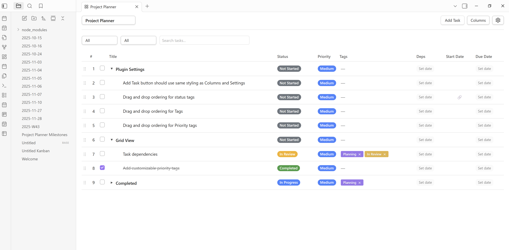
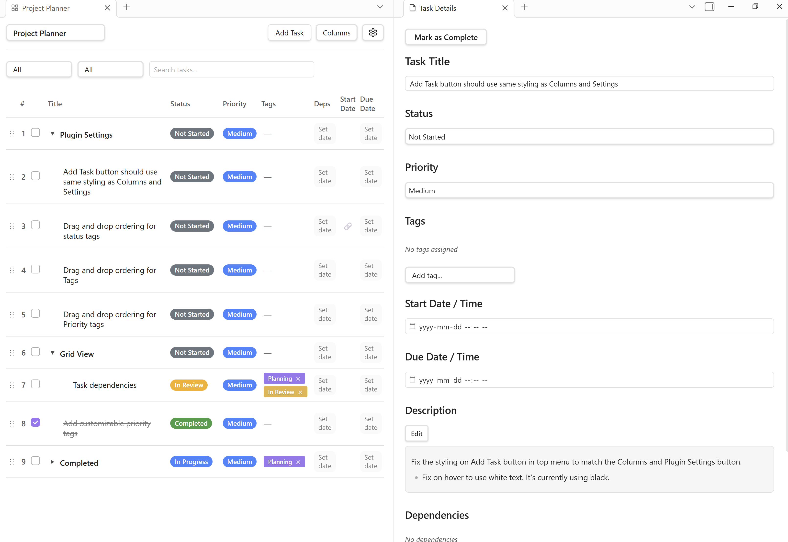
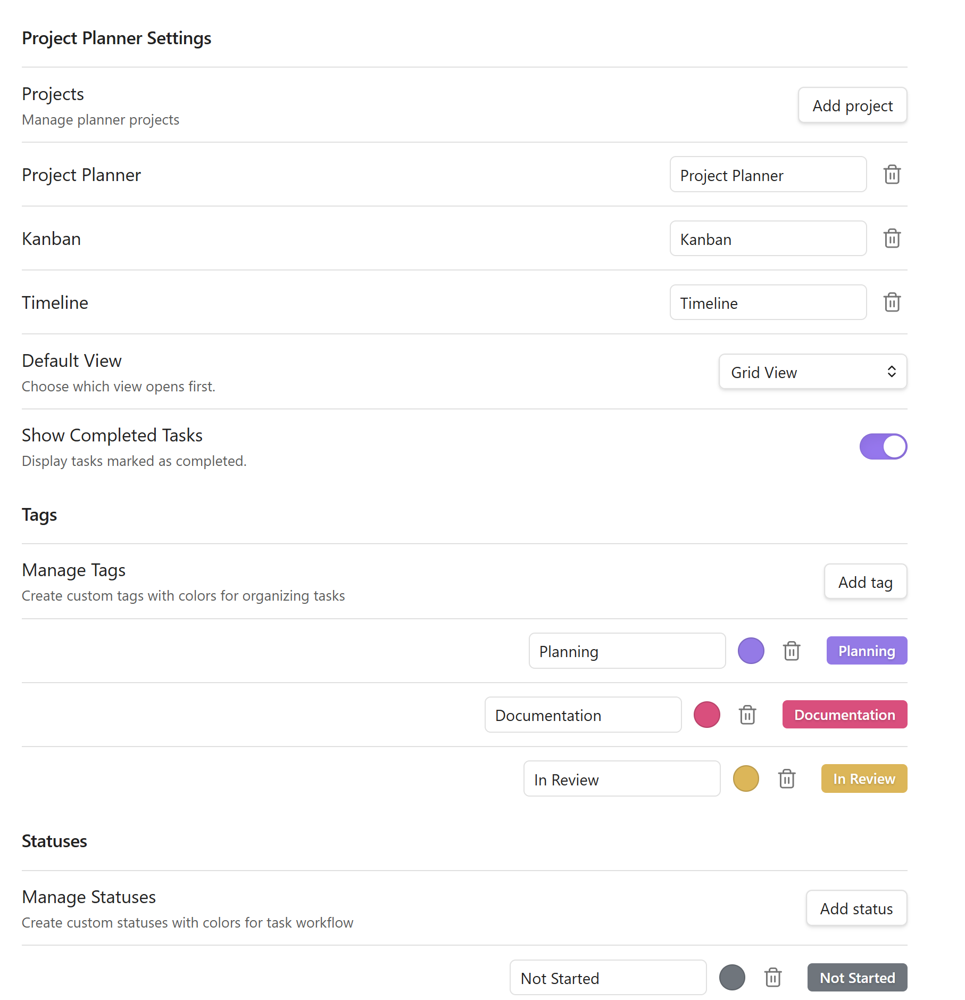

# Obsidian Project Planner

A project planner for **ObsidianMD** based on **Microsoft Premium Planner**.

## Current Version

- Version 0.4.0

## Features

| Feature           | Description                                   | Version |
| ----------------- | --------------------------------------------- | ------- |
| Grid View         | Table view of tasks and sub tasks             | v0.5.0  |
| Board View        | Kanban view of buckets for organizing tasks   | v1.0.0  |
| Timeline View     | Gantt style view of all tasks and subtasks    | v2.0.0  |
| Task Details      | A details panel for managing all task options | v0.5.0  |
| Multiple Projects | Support for multiple projects                 | v0.5.0  |

---

## Screen shots

---

## Documentation

**Read the documentation:** [Obsidian Project Planner Docs](https://reactivewebstudio.ca/docs/obsidian-project-planner)

---

## Roadmap

Project roadmap. All version goals are subject to change.

**View the full roadmap:** [Obsidian Project Planner Roadmap](https://reactivewebstudio.ca/docs/obsidian-project-planner#roadmap)

---

## Changelog

**Read the full changelog:** [Obsidian Project Planner Changlog](https://reactivewebstudio.ca/docs/obsidian-project-planner#changelog)
