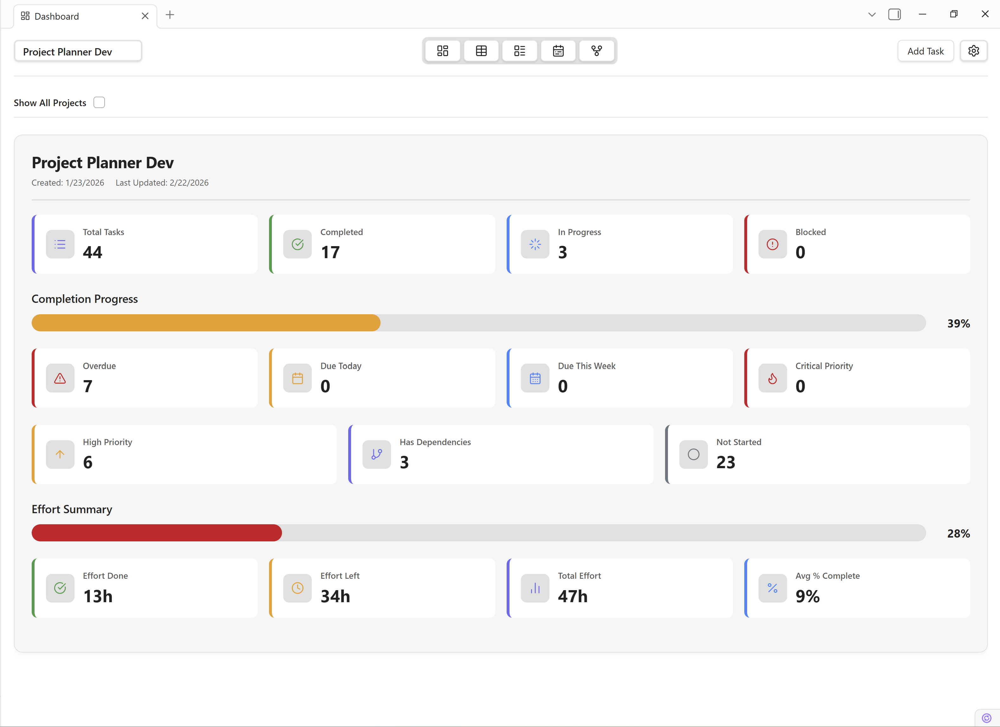
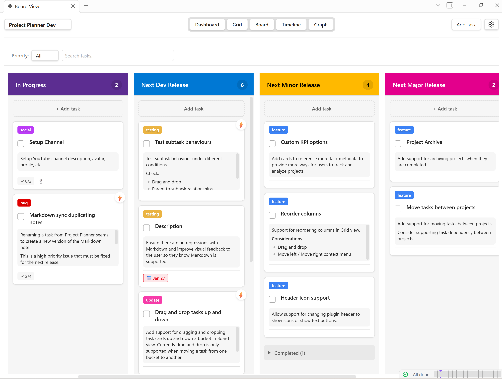
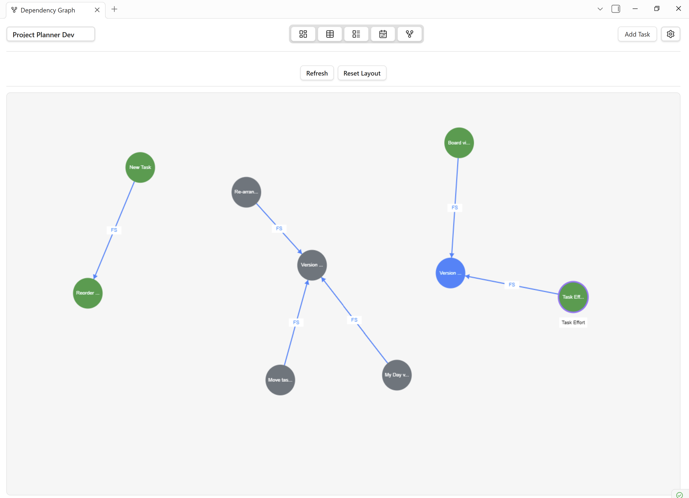

# Obsidian Project Planner

A full-featured project planner for [Obsidian](https://obidian.md) based on [Microsoft Premium Planner](https://support.microsoft.com/en-us/planner).

## Features

- Hierarchical task table with subtasks (Grid view)
- Kanban board with custom buckets and drag-and-drop
- Gantt-style timeline view
- Dashboard with project KPIs
- Task detail panel with status, priority, dates, tags, links, and dependencies
- Dependency graph visualization
- Project hub notes and task notes for graph navigation
- Bidirectional markdown sync between tasks and notes
- Deep links to tasks via Obsidian URI protocol

## Screen shots

### Dashboard view [v0.7.0]

### Grid view [v0.6.7]

### Board view [v0.6.7]

### Timeline view [v0.7.0]

### Dependency graph [v0.7.0]

### Task details - [v0.4.0]

### Plugin settings - [v0.4.0]

## Documentation

**Installation:** [How to install Obsidian Project Planner](https://projectplanner.md/docs/getting-started/installation/)

**Full documentation:** [Obsidian Project Planner Docs](https://projectplanner.md)

**Full changelog:** [Obsidian Project Planner Changlog](https://projectplanner.md/changelog/)

---

## Community

**Discussion board:** [Discussions](https://github.com/ArctykDev/obsidian-project-planner/discussions)

**Discord:** [Project Planner Discord Server](https://discord.gg/6rgmVKK4)

**YouTube:** [Project Planner YouTube Channel](https://youtube.com/@ArctykDev)

---

**Read the full changelog:** [Obsidian Project Planner Changlog](https://projectplanner.md/changelog/)

## Support

Project Planner is free to use and enjoy, but you can help support the project by joining our community, sharing Project Planner with others, or by a small donation. 

---

## ProjectPlanner.md

**Official website:** [ProjectPlanner.md](https://projectplanner.md)

**Obsidian website:** [Obsidian.md](https://obsidian.md)