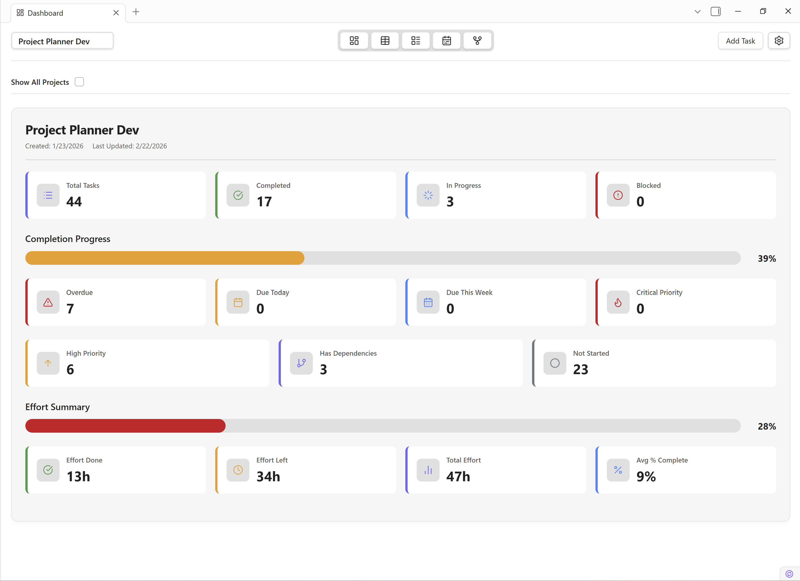
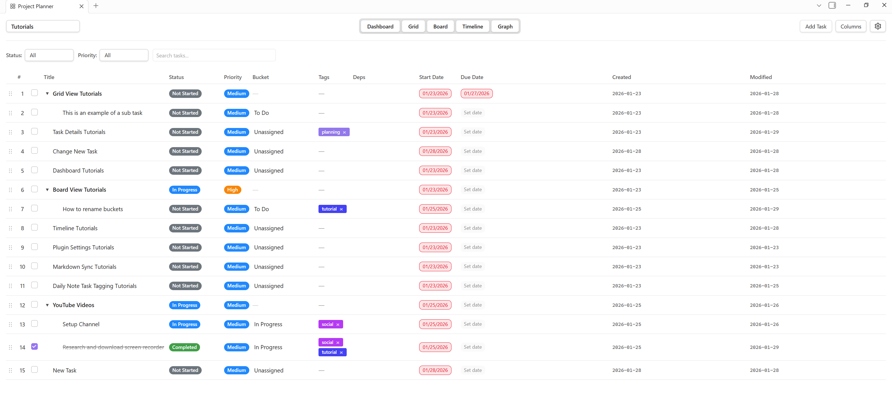
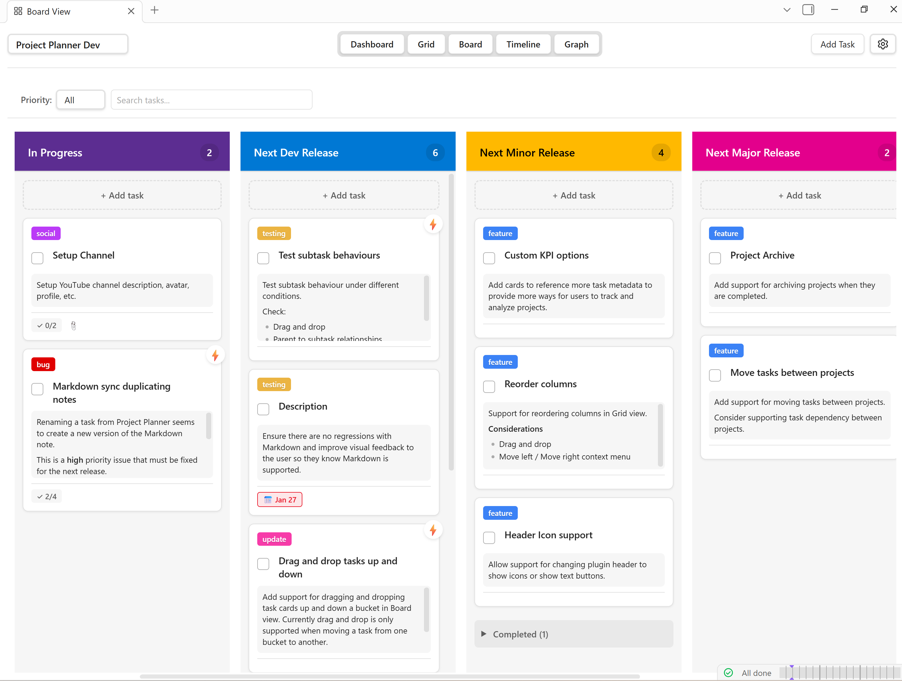
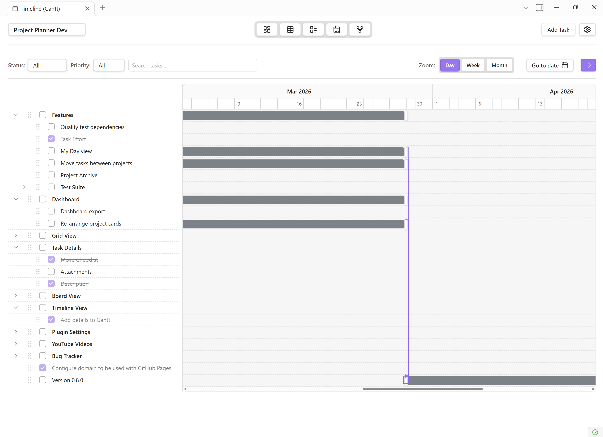
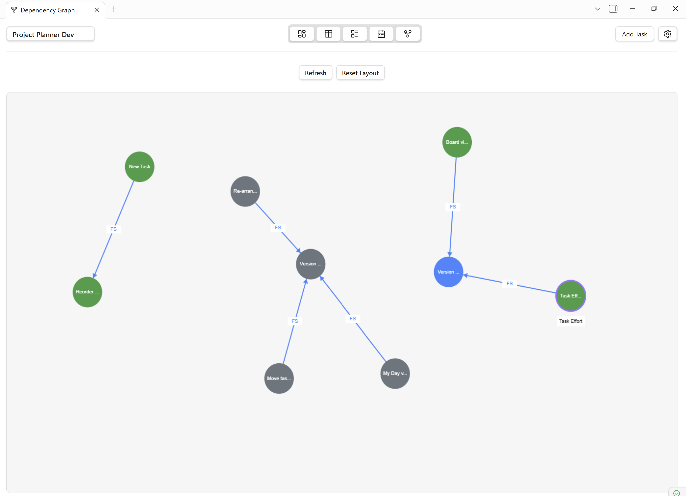
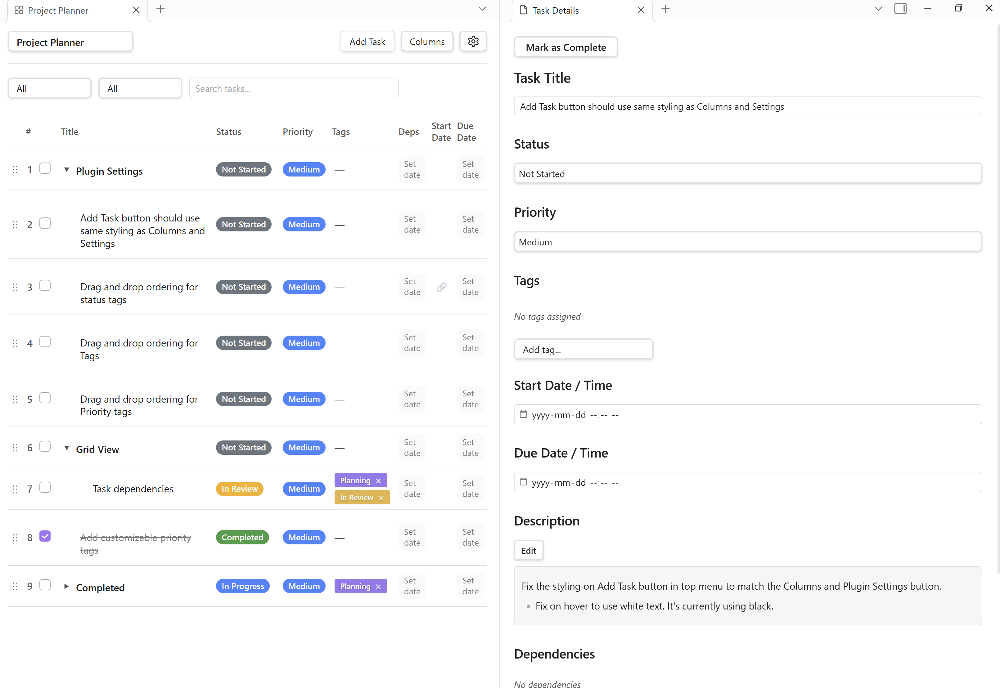
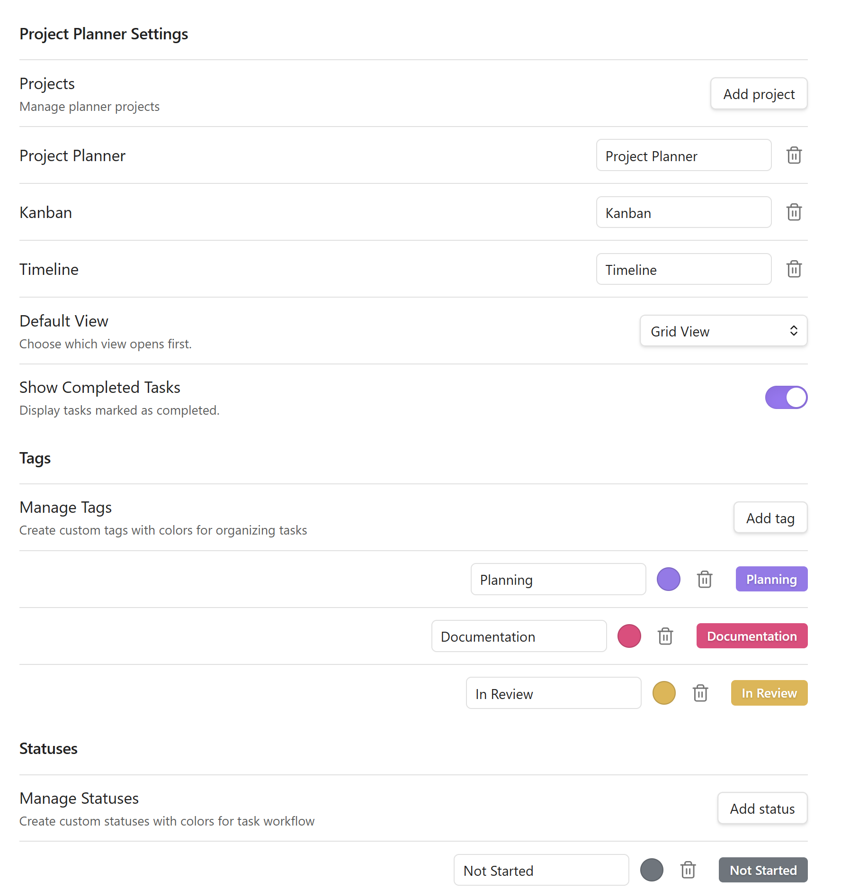

# Obsidian Project Planner

A full-featured project planner for [Obsidian](https://obidian.md) based on [Microsoft Premium Planner](https://support.microsoft.com/en-us/planner).

## Features

### Views
- **Grid View** — Hierarchical task table with parent/child subtasks, inline editing, drag-and-drop row reordering, and configurable columns
- **Board View** — Kanban board with custom buckets, drag-and-drop cards, and collapsible completed sections
- **Timeline View** — Gantt-style chart with resizable task bars, dependency arrows (FS/SS/FF/SF), and synchronized scrolling
- **Dashboard** — Project KPIs, completion progress, priority/due-date alerts, effort summary, and budget/cost cards
- **Dependency Graph** — Interactive node-based visualization of task dependencies with HiDPI canvas rendering
- **My Tasks** — Cross-project aggregation of tasks due today (table mode) or this week (Outlook-style 7-day column layout)

### Task Management
- **Task Detail Panel** — Full editing of status, priority, dates, tags, links, description, subtask checklist, effort, cost, and dependencies
- **Custom statuses, priorities, and tags** with configurable colors
- **Bucket assignment** independent of task status
- **Task dependencies** — Four types (Finish-to-Start, Start-to-Start, Finish-to-Finish, Start-to-Finish) with dependency-driven auto-scheduling
- **Parent task roll-up** — Dates, effort, % complete, and cost automatically calculated from subtasks (MS Project style)
- **Deep links** to tasks via Obsidian URI protocol

### Effort Tracking
- **Microsoft Planner-style effort system** — Completed hours, remaining hours, total, duration, and % complete
- **Smart auto-sync** — Entering completed hours auto-deducts remaining; marking a task complete moves all remaining into completed
- **Effort columns in Grid View** — % Complete, Effort Done, Effort Left, Effort Total, Duration (inline-editable)

### Cost Tracking
- **Per-task cost** — Fixed amount or hourly rate × effort hours
- **Project budget settings** — Total budget, default hourly rate, and currency symbol per project
- **Grid View cost columns** — Est. Cost and Actual Cost (toggleable)
- **Dashboard budget card** — Progress bar with color thresholds (green → yellow → red), Estimated/Actual/Remaining KPIs
- **Cost Report modal** — Breakdown by bucket, status, or priority with totals and variance; over-budget task list

### Sync & Integration
- **Bidirectional markdown sync** — Tasks sync to/from YAML frontmatter in markdown notes (status, dates, effort, tags, etc.)
- **Daily note task scanning** — Tag tasks in daily notes (e.g., `#planner`) to automatically import them into projects
- **Project hub notes and task notes** for Obsidian graph navigation

### Grid View Extras
- **Column show/hide** with checkmark menu
- **Drag-and-drop column reordering** with persistent order
- **Column resizing** with double-click auto-fit
- **Inline editing** for titles, statuses, priorities, dates, effort, and tags
- **Right-click context menu** — Add above/below, make subtask, promote, delete, open detail

### Configuration
- **Multi-project support** with project switcher in the header
- **Customizable ribbon icons** — Toggle visibility of Grid, Dashboard, Board, Graph, and Daily Note Scan icons
- **Date format options** — ISO, US, or UK
- **Per-view settings** — Column widths, visibility, and sort order persist across sessions

## Screen shots

### Dashboard view [v0.7.0]

### Grid view [v0.6.7]

### Board view [v0.6.7]

### Timeline view [v0.7.0]

### Dependency graph [v0.7.0]

### Task details - [v0.4.0]

### Plugin settings - [v0.4.0]

## Documentation

**Installation:** [How to install Obsidian Project Planner](https://projectplanner.md/docs/getting-started/installation/)

**Full documentation:** [Obsidian Project Planner Docs](https://projectplanner.md)

**Full changelog:** [Obsidian Project Planner Changlog](https://projectplanner.md/docs/changelog/)

**View the roadmap:** [Obsidian Project Planner Roadmap](https://projectplanner.md/docs/roadmap/)

---

## Community

**Discussion board:** [Discussions](https://github.com/ArctykDev/obsidian-project-planner/discussions)

**Discord:** [Project Planner Discord Server](https://discord.gg/6rgmVKK4)

**YouTube:** [Project Planner YouTube Channel](https://youtube.com/@ArctykDev)

---

## Support

Project Planner is free to use and enjoy, but you can help support the project by joining our community, sharing Project Planner with others, or by a small donation. 

---

## ProjectPlanner.md

**Official website:** [ProjectPlanner.md](https://projectplanner.md)

**Obsidian website:** [Obsidian.md](https://obsidian.md)